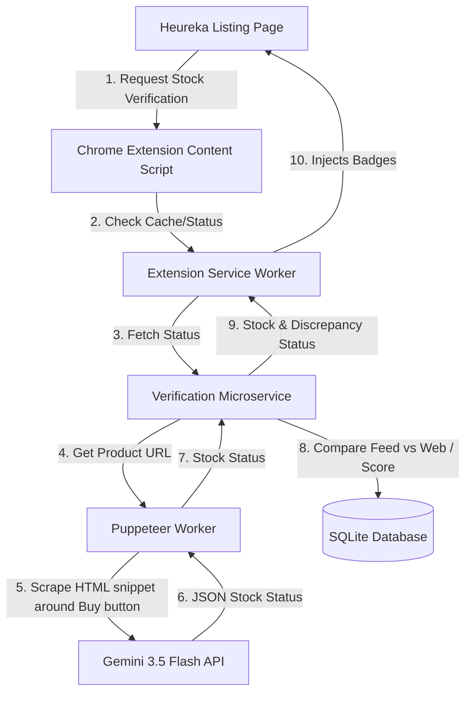

# ANTIGRAVITY.md

Guidance for **Gemini** (Antigravity CLI, `agy`) when co-developing the Heureka Real-Time Stock Verifier.
The companion file for Claude (Cowork) is `CLAUDE.md` in the same directory.
Both agents share this workspace. Before writing code, check both files to avoid contradicting the other agent's work.

---

## Technical Architecture

The project consists of three main components:

1. **Chrome Extension (Client Side)**: Content script injected on Heureka product listing pages to display verification badges, and a popup for dashboard details.
2. **Verification Microservice (Backend)**: Fastify (Node.js) service that orchestrates sampling, initiates Puppeteer scraping, calls Gemini 3.5 Flash, and calculates stock reliability scores.
3. **Puppeteer + Gemini Engine (Scraper)**: Fetches the merchant product URL, extracts relevant DOM snippets (zero-selector approach), and uses LLM to parse actual stock status.



---

## Tech Stack

| Layer | Technology |
|---|---|
| Chrome Extension | Manifest V3, vanilla JS / content scripts |
| Backend API | Express (Node.js) |
| Scraper | Puppeteer |
| LLM | Gemini 3.5 Flash (Google AI API) |
| Database | JSON file (`database.json`) via async fs write-locking |
| Frontend prototype | Next.js + Tailwind CSS |

---

## Directory Structure

```
skladem/
├── extension/             # Chrome Extension (Manifest V3)
│   ├── manifest.json
│   ├── background.js      # Service worker
│   ├── content.js         # DOM injection & badge renderer
│   ├── popup/             # Extension popup UI
│   └── icons/
├── backend/               # Fastify microservice
│   ├── src/
│   │   ├── server.js      # API router
│   │   ├── scraper.js     # Puppeteer zero-selector worker
│   │   ├── analyzer.js    # Gemini 3.5 Flash integration
│   │   └── database.js    # Scoring engine + SQLite
│   ├── prompts/           # Versioned .txt prompt templates
│   ├── package.json
│   └── .env.example
├── prototype/             # Next.js / Tailwind dashboard
├── CLAUDE.md
└── ANTIGRAVITY.md
```

---

## Development Workflow Commands

- Install all: `npm install` (from repo root once workspaces set up)
- Run backend: `npm run dev` (from `/backend`)
- Build extension: `npm run build` (from `/extension`)
- Lint / format: `npm run lint` / `npm run format` (from `/backend`)
- Run tests: `npm test`

---

## Environment Variables

Set before running the backend. Load via `process.env` or a `.env` file (gitignored — never hardcode).

| Variable | Purpose | Default |
|---|---|---|
| `GEMINI_API_KEY` | Google AI API key for Gemini 3.5 Flash | — |
| `PORT` | Fastify microservice port | `3001` |

---

## Chrome Extension — Manifest V3 Rules

Non-negotiable. Violating these causes silent bugs that are hard to trace.

### Service Worker state
- The background service worker is **ephemeral** — it spins down after ~30 seconds of inactivity.
- **Never** store state in module-level variables in the service worker. They vanish on the next wake.
- All persistent state must use `chrome.storage.local` (or `chrome.storage.session` for tab-scoped data).
- Use `chrome.alarms` for background synchronization instead of `setInterval`.

### Async messaging
- Always use `async/await` over `.then()` chains.
- Message listeners that respond asynchronously **must** `return true` to keep the channel open:
  ```js
  chrome.runtime.onMessage.addListener((msg, sender, sendResponse) => {
    handleAsync(msg).then(sendResponse);
    return true; // required — omitting this silently breaks the response
  });
  ```

### Modules
- Prefer ESM (`import/export`) throughout. Never mix CommonJS and ES Modules.
- Content scripts support ESM via `"type": "module"` in `manifest.json`.

### Permissions
- Scope host permissions tightly: `https://*.heureka.cz/*`, `https://*.heureka.sk/*`, and the backend API origin only.

---

## Puppeteer — Zero-Selector Scraping Strategy

Goal: extract the purchase area without any site-specific CSS selectors.

1. Find interactive elements containing keywords: `košík`, `koupit`, `přidat`, `skladem`, `dostupnost`, `cart`, `buy`, `stock`, `add to cart`
2. Traverse 2–3 parent nodes to capture surrounding context (quantity inputs, delivery estimates, warning text)
3. Extract clean text + outer HTML snippet — **cap at 3 KB** to keep token cost and latency low
4. Block unnecessary resources to speed up page load: images, stylesheets, fonts, analytics scripts

---

## Gemini 3.5 Flash — Prompt & Output Contract

Treat Gemini as a **deterministic parsing function**, not a chatbot. Prompt templates live in `/backend/prompts/` as versioned `.txt` files — iterate them independently of application code.

Expected JSON output (strict — parse with `JSON.parse`, reject anything else):

```json
{
  "status": "IN_STOCK" | "OUT_OF_STOCK" | "DELAYED" | "UNKNOWN",
  "shipping_days": number | null,
  "confidence": 0.0,
  "reasoning": "brief explanation"
}
```

---

## Scoring Engine

- Initial reliability score: **S₀ = 100**
- On discrepancy: `S_new = max(0, S_old − (10 × SeverityMultiplier))`
  - `OUT_OF_STOCK` when feed says in stock → SeverityMultiplier = **2**
  - `DELAYED` (XML says 0 days, web says 7+ days) → SeverityMultiplier = **1**
- Recovery: **+2 per correct verification**, capped at 100

---

## Badge UI Spec

| State | Color | Hex | Notes |
|---|---|---|---|
| Verified in stock | Green | `#2ecc71` | Subtle pulse animation |
| Stock discrepancy | Red | `#e74c3c` | Warning flag icon |
| Delayed shipping | Orange | `#f39c12` | Clock icon |

Use Vanilla CSS for injected badges — no external stylesheets.

---

## AI Collaboration Note

This project is co-developed by **Gemini 3.5 Flash** (Google, via Antigravity CLI `agy`) and **Claude** (Anthropic, via Cowork).

- Gemini's guidance file: `ANTIGRAVITY.md` (this file)
- Claude's guidance file: `CLAUDE.md`
- Both agents share the same `/Skladem` workspace
- When in doubt about a decision the other agent made, read `CLAUDE.md` before overriding
